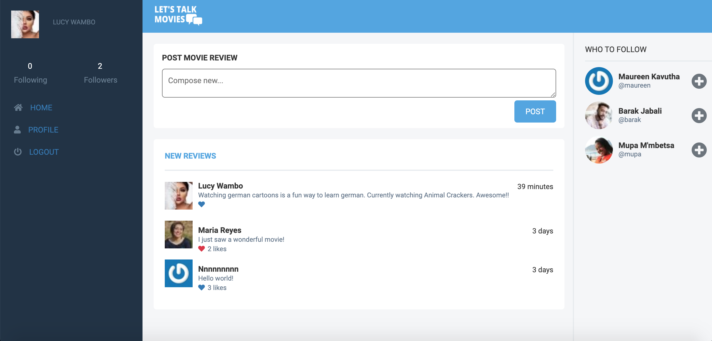
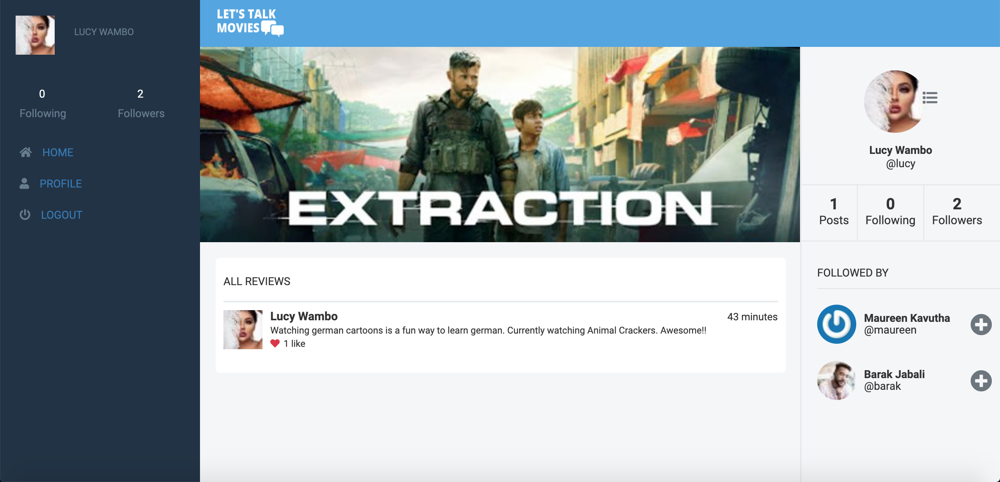

# Lets Talk Movies

A Desktop Social Media Web App for connecting Movie fans. Fans can post their opinions about movies or series they've watched, like opinions, follow their friends or other users whose content they enjoy consuming.

## Screenshots
#### Homepage


#### Profile Page


## Live Demo

[Heroku App Link](https://lets-talk-movies.herokuapp.com/)

## Video Presentation

[Link to video presentation]()

## Project Specification

An MVP version of an app following [Design idea](https://www.behance.net/gallery/14286087/Twitter-Redesign-of-UI-details) by Gregoire Vella on Behance.

## Future features
 
1. Add functionality for users to comment on posts.

## Built With

- Ruby v2.7.0
- Ruby on Rails v5.2.4
- Rspec-Rails

## Getting Started

To get a local copy up and running follow these steps:

### Prerequisites

- Ruby: 2.7.0
- Rails: 5.2.4
- Postgres: >=9.5
- Git

### Usage

- Fork/Clone this project to your local machine
- Open folder in your local enviroment and run these lines of code to get started:

Install gems with:

```Ruby
    bundle install
```

Setup database with:
```Ruby
    rails db:create
```

```Ruby
    rails db:migrate
```

Setup cloudinary:

- Goto `cloudinary.com` setup your account and get your cloudinary credentials.
- Add the credentials to the `config/application.yml` like this :
```
CLOUDINARY_NAME: "YOUR_CLOUDINARY_NAME"
CLOUDINARY_API_KEY: "YOUR_CLOUDINARY_API_KEY"
CLOUDINARY_API_SECRET: "YOUR_CLOUDINARY_API_SECRET"
```
- Don't forget to add that file to your .gitignore file.

Start server with:

```Ruby
    rails server
```

Then open a web page and go to [port 3000 on your local machine.](http://localhost:3000)

### Running tests

```Ruby
    rspec
```

### Deployment

The application was deployed on heroku.
To deploy your own copy, you can follow the following [steps:](https://devcenter.heroku.com/articles/git)

## Author

👤 **Mupa M'mbetsa Nzaphila**

- Github: [@mupa1](https://github.com/Mupa1)
- Twitter: [@mupa_mmbetsa](https://twitter.com/mupa_mmbetsa)
- Linkedin: [mupa-mmbetsa](https://www.linkedin.com/in/mupa-mmbetsa)

## 🤝 Contributing

Contributions and feature requests are welcome!

Start by:

- Forking the project
- Cloning the project to your local machine
- `cd` into the project directory
- Run `git checkout -b your-branch-name`
- Make your contributions
- Push your branch up to your forked repository
- Open a Pull Request with a detailed description to the development(or master if not available) branch of the original project for a review

#### Feel free to also check the [issues](https://github.com/Mupa1/Lets-Talk-Movies/issues) page.

## Show your support

Give a ⭐️ if you like this project!

## Acknowledgments

- Design idea by [Gregoire Vella](https://www.behance.net/gregoirevella).
